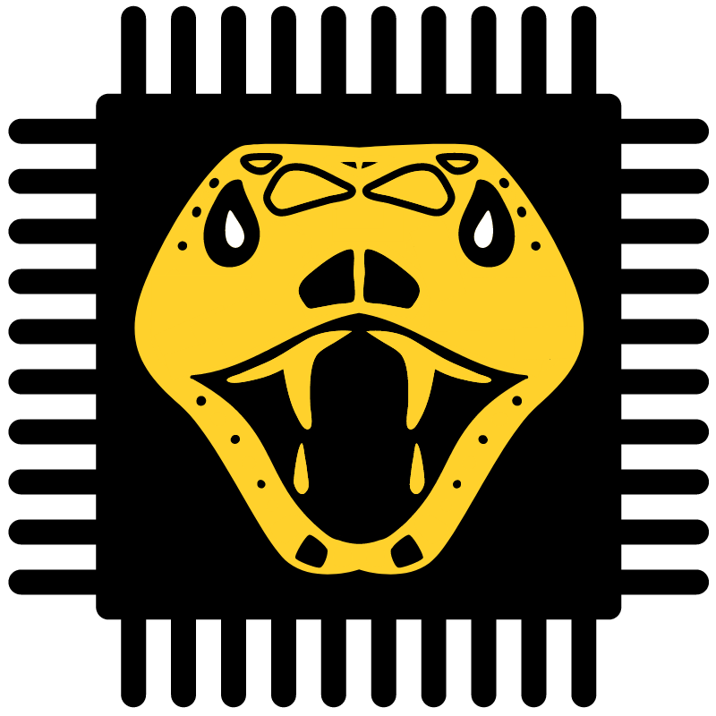

# Caninana

Caninana is a StarCraft 2 AI. Our goal is to make a strong bot to play versus humans. 
- Initial support for Zerg (Later support for all races);
- Scout and try to respond what enemy actions;

## Features
- Worker manager 
  - [x] Basic gathering distribution 
  - [x] Order Workers
- Army manager
  - [x] Basic overlord Scout
  - [x] Unit control
  - [x] Full aggression
  - [x] Order units
  - [x] Order tech buildings
  - [x] Order tech upgrades
  - [x] Order upgrades
  - Basic troop support
    - [x] Zergling
    - [x] Baneling
    - [x] Roach
    - [x] Ravager
    - [x] Hydralisk
    - [ ] Lurker
    - [ ] Infestors
    - [x] Mutalisk
    - [x] Corruptor
    - [x] Ultralisk
    - [x] Brood Lord
- Queen manager (Zerg specific)
  - [x] Injection
  - [x] Creep spread
  - [x] Transfusion
- Resource manager
  - [x] Order Supply
  - [x] Order Expansion
  - [x] Order gas extractor construction
- Production manager
  - [x] Basic construction placement
  - [x] Produce unit
  - [x] Produce upgrades
  - [x] Check missing buildings to produce units (e.g. Need a roach warren to produce roaches)
  - [x] Check missing buildings to produce upgrades
- Basic openings
  - [x] Pool first

# Issues
- All production is done on Production manager, can be a problem for later speed mining;
- Creep spread might try to spread towards places it cannot;